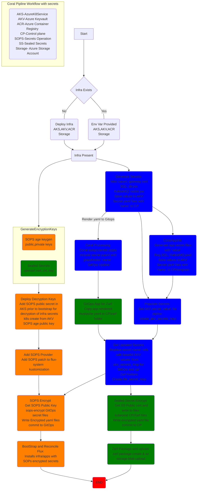

# Introduction

The Mission Platform Ops Athena Control Plane Seed enhances the base [Coral](https://github.com/microsoft/coral) control plane seed by:

- Automating the deployment of Azure resources used for testing.
- Integrating an Istio service mesh and dial-tone services.
- Providing Azure Key Vault (AKV) integrated secrets management.
- Enabling packaging for air-gapped deployments with Zarf.

This seed was originally developed to support the deployment of Crew Athena's Network Observability solution.  [Example Deployment - Network Observability Solution](./docs/tutorials/no_tutorial.md) is provided to deploy that solution with this seed and serves as an in-depth tutorial for the capability.

Interested Microsoft parties can join the project on [Azure DevOps](https://dev.azure.com/CSECodeHub/CSE%20Gov%20-%20Mission%20Capabilities).

## Coral

The Mission Platform Ops Athena Control Plane Seed is built on the [Coral](https://github.com/microsoft/coral) platform and largely follows the patterns established there.  Before deploying a solution with this seed, it is important to understand the basic concepts, roles, and deployment methodologies of Coral.  A [Documentation Hub](https://github.com/microsoft/coral/blob/main/docs/documentation-hub.md) is provided within the Coral repo.  It may be helpful to deploy the base Coral platform and one of the sample applications, starting with [Setting up the Coral Platform](https://github.com/microsoft/coral/blob/main/docs/platform-setup.md), before deploying a solution with this seed.

**Note: It is not required to deploy the base Coral platform to use this seed or to deploy the example Network Observability solution.**

## Overview

Control-planes built with this seed utilize CI/CD pipelines to deploy and manage their required infrastructure and services.  Pipeline files are available for both [GitHub](./.github/workflows/transform.yaml) Workflows and [GitLab](./.gitlab-ci.yml) Pipelines.  When commits are made to the `main` branch of the control-plane, directly or via a Pull Request, the pipelines execute the following flow.

### Repo Organization

- `.github/workflows` - Defines a GitHub workflow that transforms Coral entities into the associated cluster GitOps repo YAML to be processed by Flux.
- `applications`
  - `<workspace-name>`
    - `ApplicationRegistrations` - Defines the `ApplicationRegistrations` for a given workspace ([sample](https://github.com/microsoft/coral/blob/main/docs/samples/ApplicationRegistration.yaml)).
    - `ManifestDeployments` - Defines the `ManifestDeployments` (dial-tone services) for a given workspace.
- `assignments` - Holds the application:cluster assignments after Coral processes the repo.
- `clusters` - Defines the `Clusters` in your platform ([sample](https://github.com/microsoft/coral/blob/main/docs/samples/Cluster.yaml)).
- `docs` - Contains documentation related to the design, development, and deployment of the solution.
- `infrastructure` - Contains the deployment script for creating infrastructure, along with a state file.
- `manifests` - Holds Kubernetes YAML for use with `ManifestDeployments`.
- `scripts` - Contains scripts used by the CI/CD pipelines.
- `templates` - Defines the available `ApplicationTemplates` in your platform ([sample](https://github.com/microsoft/coral/blob/main/docs/samples/ApplicationTemplate.yaml)).
- `workspaces` - Defines the `Workspaces` in your platform ([sample](https://github.com/microsoft/coral/blob/main/docs/samples/Workspace.yaml)).
- `zarf` - Artifacts required to package the solution for air-gapped deployments with [Zarf](https://zarf.dev).
- `.gitlab-ci.yml` - Defines a GitLab Pipeline that transforms Coral entities into the associated cluster GitOps repo YAML to be processed by Flux.

### Azure Infrastructure

The following Azure resources may be deployed automatically by the CI/CD pipeline(s) using a Service Principal or manually to support testing solutions that use this seed.  The `DEPLOY_INFRA` secret/variables may be set to `false` to skip the deployment of these resources.  The names of any resources not created automatically by the pipelines must be provided as secrets/variables to the CI/CD pipeline ([CI/CD Pipeline Secrets and Variables](./docs/learn_more/secrets_variables.md)).

- [Azure Service Principal](https://learn.microsoft.com/en-us/azure/active-directory/develop/app-objects-and-service-principals)
- [Azure Resource Group](https://learn.microsoft.com/en-us/azure/azure-resource-manager/management/manage-resource-groups-cli)
- [Azure Key Vault](https://learn.microsoft.com/en-us/azure/key-vault/general/overview)
- [Azure Container Registry](https://learn.microsoft.com/en-us/azure/container-registry/container-registry-intro)
- [Azure Kubernetes Service](https://learn.microsoft.com/en-us/azure/aks/intro-kubernetes)
- [Storage Account](https://learn.microsoft.com/en-us/azure/storage/common/storage-account-overview)

### Dial Tone Services

The Mission Platform Ops Athena Control Plane Seed deploys the services listed below to support centralized logging, observability, monitoring, and a service mesh.  Each component is implemented as a [Flux HelmRelease](https://fluxcd.io/flux/components/helm/helmreleases/) and values are applied via [Coral Patches](https://github.com/microsoft/coral/blob/main/docs/platform-patch-manifest.md).

- [Fluentbit](https://github.com/fluent/fluent-bit) - Log Collection and Aggregation
- [Elasticsearch](https://github.com/elastic/elasticsearch) - Log Storage and Search
- [Kibana](https://github.com/elastic/kibana) - Log Visualizations
- [Istio](https://github.com/istio/istio) - Service Mesh and Distributed Tracing Metrics
- [Prometheus](https://github.com/prometheus/prometheus) - Metric Collection and Persistence
- [Grafana](https://github.com/grafana/grafana) - Metric Visualization and Dashboards
- [Zipkin](https://github.com/openzipkin/zipkin) - Distributed Trace Monitoring and Visualization

For more information on why and how these dial-tone services are implemented in the Network Observability solution, please refer to the [Centralized Logging](./docs/design-decisions/centralized-logging.md), [Service Mesh](./docs/design-decisions/istio-service-mesh.md), and [Observability and Monitoring](./docs/design-decisions/observability-monitoring.md) docs.

## Tutorials

- [Example Deployment - Network Observability Solution](./docs/tutorials/no_tutorial.md)
- [Example Deployment - Coral App Seed](./docs/tutorials/coral_sample.md)
- [Adding or Removing Dial-Tone Services](./docs/tutorials/adding_dialtone_services.md)

## Learn More

- [CI/CD Pipeline Secrets and Variables](./docs/learn_more/secrets_variables.md)
- [Secrets Management](./docs/design-decisions/secret-management.md)
- [Certificate Management](./docs/design-decisions/certificate-management.md)
- [AKS Storage](./docs/design-decisions/storage-azure-fileshare.md)
- [RKE Deployment and Storage](./docs/rke/README.md)
- [ASE Deployment and Storage](./docs/ase/README.md)
- [Service Specific Dashboard Configuration for Grafana]((./docs/design-decisions/service-specific-dashboard-configuration.md))
- [Zarf](./docs/design-decisions/zarf-package-upload.md)

## Contributors ✨

<!-- ALL-CONTRIBUTORS-LIST:START - Do not remove or modify this section -->
<!-- prettier-ignore-start -->
<!-- markdownlint-disable -->
<table>
  <tr>
    <td align="center"><a href="https://github.com/robcamer"> <b>Rob Cameron</b></a> </td>
    <td align="center"><a href="https://github.com/marshallbentley"> <b>Marshall Bentley</b></a> </td>
    <td align="center"><a href="https://github.com/davesee"> <b>Dave Seepersad</b></a> </td>
    <td align="center"><a href="https://github.com/sweanan"> <b>
    Swetha Anand</b></a> </td>
  <tr>
    <td align="center"><a href="https://github.com/beijiez"> <b>Beijie Zhang</b></a> </td>
    <td align="center"><a href="https://github.com/malcmiller"> <b>Malcolm Miller</b></a> </td>
    <td align="center"><a href="https://github.com/lucaswatterson"> <b>Lucas Watterson</b></a> </td>
    <td align="center"><a href="https://github.com/shahedc"> <b>
    Shahed Chowdhuri</b></a> </td>
  </tr>
</table>

<!-- markdownlint-enable -->
<!-- prettier-ignore-end -->
<!-- ALL-CONTRIBUTORS-LIST:END -->

## Contributing

This project welcomes contributions and suggestions.  Most contributions require you to agree to a Contributor License Agreement (CLA) declaring that you have the right to, and actually do, grant us the rights to use your contribution. For details, visit <https://cla.opensource.microsoft.com>.

When you submit a pull request, a CLA bot will automatically determine whether you need to provide a CLA and decorate the PR appropriately (e.g., status check, comment). Simply follow the instructions provided by the bot.  You will only need to do this once across all repos using our CLA.

This project has adopted the [Microsoft Open Source Code of Conduct](https://opensource.microsoft.com/codeofconduct/).
For more information see the [Code of Conduct FAQ](https://opensource.microsoft.com/codeofconduct/faq/) or
contact [opencode@microsoft.com](mailto:opencode@microsoft.com) with any additional questions or comments.

## Trademarks

This project may contain trademarks or logos for projects, products, or services. Authorized use of Microsoft trademarks or logos is subject to and must follow [Microsoft's Trademark & Brand Guidelines](https://www.microsoft.com/en-us/legal/intellectualproperty/trademarks/usage/general).  Use of Microsoft trademarks or logos in modified versions of this project must not cause confusion or imply Microsoft sponsorship.  Any use of third-party trademarks or logos are subject to those third-party's policies.
