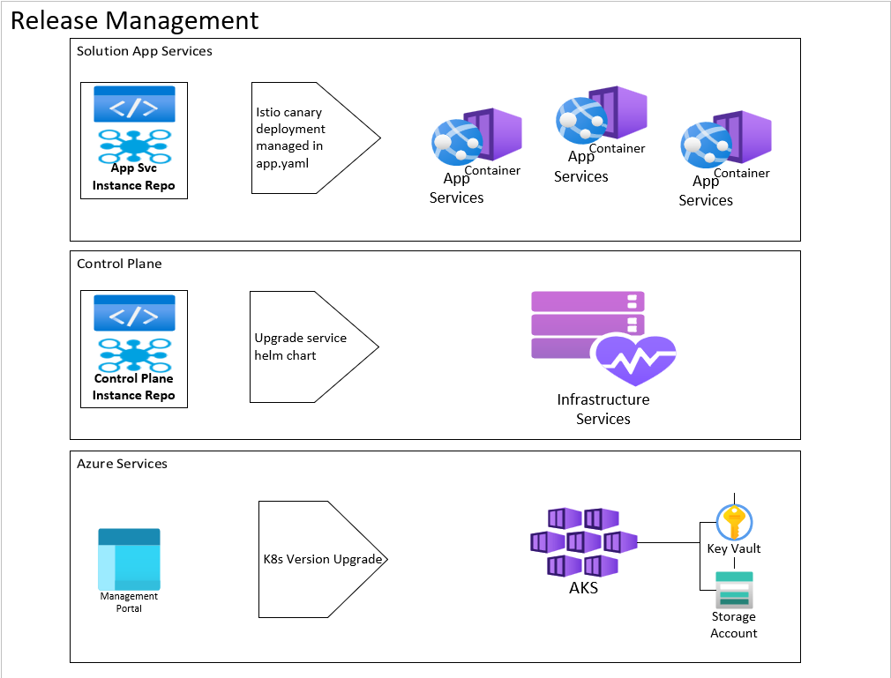
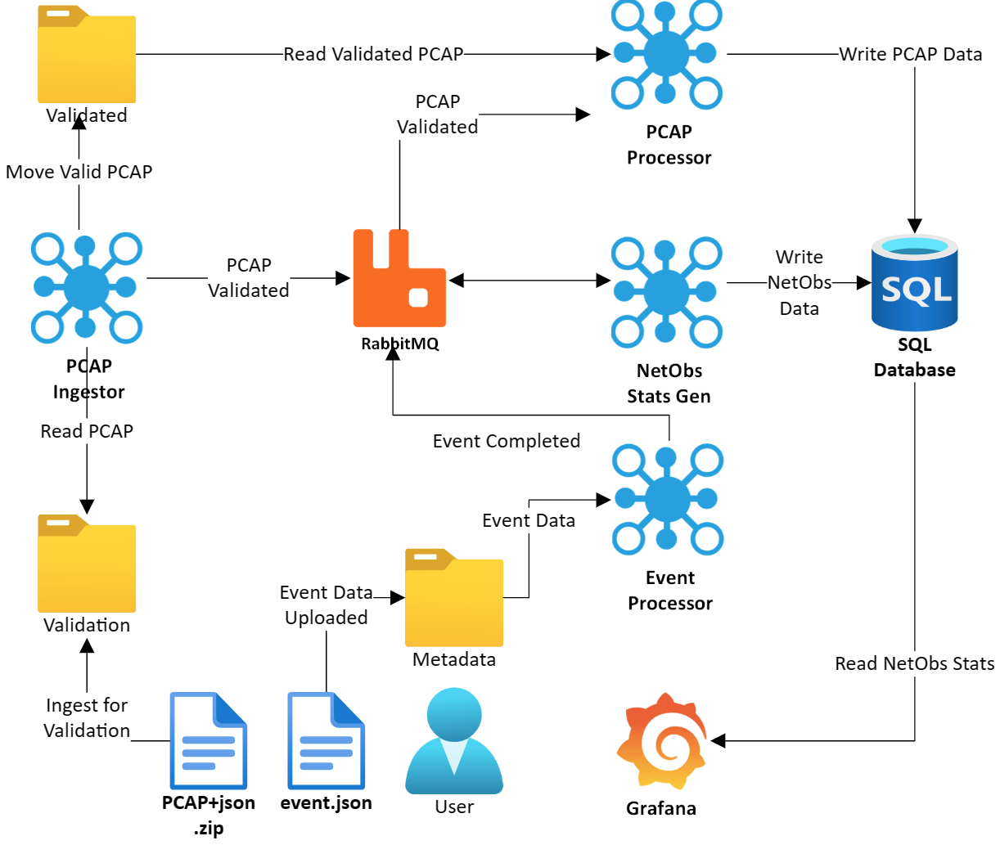
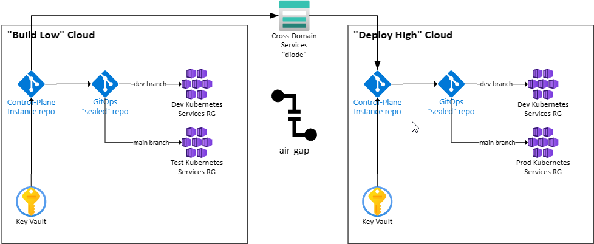

# Network Observability Solution Release Management

**Author:** Robert Cameron, Marshall Bentley, Beijie Zhang

**Date:** 30 Jan 2023

**Status:** Review

[Reference](https://www.industrialempathy.com/posts/design-docs-at-google/)

## Context and Scope

This document covers the release management process approach for the Network Observability solution implemented based on [Coral](https://github.com/microsoft/coral) and GitOps.  The Network Observability solution is organized with the infrastructure such as prometheus, grafana, istio, elasticsearch, etc.,  deployed in the Control Plane repo separate from the individual pcapng handling services deployed from individual app svc instance repos.  This diagram maps out the logical architecture of the various git repos that are part of the overall solution and how deployment occurs:

A "Release" for the network Observability Solution can be an update to one of the following as shown below:

1. Azure Kubernetes Service Kubernetes Version Upgrade
2. Upgrade of an infrastructure service maintained in the Control Plane repo Instance
3. Upgrade of an individual App Service maintained in App Service repo instance

A significant discussion point is Canary Deployment vs. Blue/Green deployment for testing updates.  This [article](https://medium.com/buildpiper/canary-vs-blue-green-deployment-which-one-should-you-choose-a7d86d2929f0) provides a high-level summary to help ensure a common understanding exists.

For this solution and control-plane, a Canary Deployment mechanism is implemented in the [`istio-service` yaml template](../../templates/istio-service.yaml) for app service deployment as documented in the istio-service [README.md](../../templates/istio-service/README.md)

## Goals and Non-Goals

Goals:

- Define the process for performing a control-plane infrastructure service update
- Support canary deployment of individual .NET services release updates
- Define how versions are maintained and incremented for the control plane and individual service repos
- Leverage istio capabilities to support release management.
- Implement as much as possible, release management in the seed repos such that new instance repos inherit the defined best practices.

Non-Goals:

- Implementing blue/green deployment model is out of scope as it more a matter of deploying a separate production Kubernetes environment, which is straight forward for Coral to deploy to multiple clusters defined for production use to support blue / green deployment.  Azure has [guidance](https://learn.microsoft.com/en-us/azure/architecture/reference-architectures/containers/blue-green-deployment-for-aks/blue-green-deployment-for-aks) on implementing blue/green deployments with AKS for this scenario.

 For information defining how to update the AKS Kubernetes version, refer to the [Upgrade the Kubernetes version of an AKS workload cluster using Windows Admin Center](https://learn.microsoft.com/en-us/azure/aks/hybrid/upgrade-kubernetes)

## Overview

For the control-plane repo, keeping infrastructure and services up-to-date for security vulnerabilities, bugs, feature updates, is a necessity for any production system.  How updates are tracked, tested, and managed defines Release Management.  Minimizing ongoing technical debt required to apply updates is a key goal for production systems and the design of the system should include optimizations to support smooth application of high-quality, tested, updates as part of release management for both the control-plane and individual services.  The goals are similar with respect to the individual app services that are part of the overall solution

A key requirement to consider is messaging provided by rabbitmq.  Istio Traffic Management supports routing to / from RabbitMQ with services.  In addition, Rabbitmq can be customized to implement "weighted routing" to support canary testing of new .NET Services that use rabbitmq for message-based communication.  Here is an example of [rabbitmq weighted routing](https://github.com/achilleasa/rabbitmq-weighted-routing-exchange) to consider in the design of release management for the control plane.

### YAML Best Practices

All Kubernetes objects can be described in code as YAML, including the Network Observability Solution Control Plane and individual app services.  Here are relevant Kubernetes design  recommendation articles to consider when creating YAML for versioning as well as other requirements:

[Recommended Labels | Kubernetes](https://kubernetes.io/docs/concepts/overview/working-with-objects/common-labels/#labels)

You can visualize and manage Kubernetes objects with more tools than kubectl and the dashboard. A common set of labels allows tools to work interoperably, describing objects in a common manner that all tools can understand. In addition to supporting tooling, the recommended labels describe applications in a way that can be queried. The metadata is organized around the concept of an application.

[Kubernetes labels: 11 things to know | Enable Sysadmin (redhat.com)](https://www.redhat.com/sysadmin/kubernetes-labels-best-practices#:~:text=8%20Kubernetes%20labeling%20best%20practices%20to%20follow%201,cross-cutting%20concerns%20...%208%208.%20Automate%20labeling)

Using Kubernetes labels effectively requires an understanding of tagging methods, labeling use cases, best practices, and things you definitely want to avoid.

[The Azure Kubernetes Service Checklist - ✨ Be ready for production ✨ (the-aks-checklist.com)](https://www.the-aks-checklist.com/)

Use Mariner COS as host OS: Mariner Container-Optimized OS is a first-party operating system for Azure Kubernetes Service (AKS) that is optimized for running Kubernetes workloads. Mariner is a secure, lightweight, and highly performant operating system that is based on the open source project CoreOS Container Linux.

### System Context Diagram

The Network ObservabilityLogical Repo Deployment Diagram above maps out the logical architecture of the various git repos that are part of the overall solution and how deployment occurs.

Once deployed, this logical application service and data flow diagram maps out the solution.

### Control-Plane Release Management

This section discusses how to update and manage infrastructure services deployed on to the Network Observability Control Plane once deployed.  The root [README.md](../../README.md) lists the Infrastructure Services grouped by engineering fundamental under the section [Dial Tone Services](../../README.md#dial-tone-services).

Upgrading an infrastructure service entails following the guidance for the service, reviewing release notes for breaking changes, and incrementing the version number to deploy in the service's corresponding manifest in the [manifest folder](../../manifests/).  Once the change is commited, the change will be pushed to the GITOPS repo for deployment to the configured Kubernetes cluster(s).

### Individual Service Release Management

Individual service may receive changes over time, therefore it is important to have release management steps outlined to ensure stable new releases. The control-plane repo will utilize Istio's canary to perform A / B deployments for release testing. The canary deployment will use a feature branch on an existing repo instead of a different app / repo for better source of truth management.

Services can be released in the following steps:

1. Create a new remote branch `canary` in the repo with desired changes implemented
2. Upon pushing changes, pipeline workflow will automatically build and push the image with tag of the canary branch
3. First pull request to add canary deployment definition in `app.yaml` in **main** branch with canary template from [istio-service-mesh](./istio-service-mesh.md#canary-deployments). Weight percentage can be adjusted for intended testing pattern e.g. 100 to shift all traffic to canary, 0 to shift no traffic to canary
4. Post deployment, the canary application can now be tested based on desired functionality
5. Logs / observability will indicate status of the new changes. Once verified, the weight value can be adjusted to 0 to shift traffic to application's main branch version
6. Second pull request to merge `canary` branch changes into main
7. (Optional) If needed, create a new release with higher version number and tag

Release management flow can be illustrated in the diagram below.

## Degree of Constraint

This solution will leverage the best capabilities and practices currently in use for Cloud Native Kubernetes deployments and release management.

This solution will leverage the istio service mesh that provides traffic management capabilities to support canary deployments of .NET services as part of the Network Observability solution.

## Additional Considerations and Alternatives

### Service Mesh

We considered not adding a Service Mesh for simplicity but decided that for a production quality, multi-solution / multi-service deployment capability, the capabilities of a service mesh are worth adding the additional complexity.

### Deployment Architectures

There are several deployment models to consider that depend on how the cloud resources are organized and related deployments managed.  As noted in the docs, the scripted deployment built into the Network Observability Control Plane Seed repo is for DEMO purposes only, deploying a single Azure Kubernetes Service (AKS) and related Azure services to support test and experimentation.

A full customer production deployment can come in different forms, i.e. single subscription, multiple subscriptions, air-gap deployment, and edge deployment.  The next several sections discuss example architectures and some possible implementation options for consideration with these deployment architectures.

For discussion purposes, these are the environments:

- Dev
- Test
- Prod

Individual organizations take different approaches with fewer or more environments.  The below discussions can be tailored as necessary.

#### Single Subscription with Resource Group Environment Isolation

In this scenario, a customer has a single subscription where the dev, test, and production environments are separated into resource groups.

In this case, a single control-plane instance would run on environment-specific branches to create a deployment for that environment Kubernetes.

Note that a single Key Vault is specified but it would also be an option to have a Key Vault for each environment if that isolation is required.

New features / code updates are PR'd from the dev branch, to the test branch, and then eventually to the production branch.  Of course, there are many different approaches to git branching and merging so this example is simply to help convey the possible mechanisms for creating a release.

#### Multiple Dedicated Subscriptions Per Environment

In this scenario, a customer has separate isolated subscriptions for dev, test, and production deployments each with their own control-plane and Key Vault for secrets.

In this scenario, code is migrated from the dev environment, to the test environment, and eventually to the production environment by copying code on to the target control-plane and conducting a PR into that repo to publish the code.

#### Build-Low / Deploy-High (air-gapped) Environment

The approach to release management follows the above guidance except that code must be moved across the air-gap to be released into production.  In this scenario, there are at least two environment subscription, one in the "build low" cloud and another subscription in the "deploy high cloud".

The next two diagrams describe how these two approaches can be used for the build-low / deploy-high deployment.

#### Cloud-Build / Edge Deployment (disconnected deployment) Environment

For disconnected deployment to Kubernetes clusters at the edge or as an alternative mechanism to deploy to air-gapped cloud Kubernetes with minimal configuration in the air-gapped cloud, [Zarf](https://github.com/defenseunicorns/zarf) can be used to package up containers, configuration, and deployment manifests into a single .tar file.  For more information on Zarf, please review the [Zarf documentation](https://zarf.dev/).

For our scenario, the coral control plane seed will be modified to include the ability to generate a Zarf package as part of the build pipelines for GitHub and GitLab.  This Zarf package will match the exact configuration of the control-plane when used for disconnected deployment including the application deployment yaml manifests.

## Engineering Fundamentals

Regarding engineering fundamentals, the network observability control plane infrastructure services address key engineering fundamentals as described in the root [README.md](../../README.md#dial-tone-services).

### Environment Variable Management

The deployment model implemented in the Network Observability Control Plane seed supports configuring unique environment variables on a per application service basis.  While this adds additional complexity for configuration, it provides maximum flexibility to support DOD accreditation and Authority to Operate allowing full implementation of the "Need to Know" principle.

### Secrets Management

The deployment model implemented in the Network Observability Control Plane seed supports configuring unique secrets on a per application service basis.  While this adds additional complexity for configuration, it provides maximum flexibility to support DOD accreditation and Authority to Operate allowing full implementation of the "Need to Know" principle. More details are in the documentation.

In addition, secrets and related configuration, certificates, are stored in Azure Key Vault on a per deployment environment (e.g. dev, test, prod, etc.) basis to isolate secrets access.  More details are in the documentation.

[Reference](https://www.industrialempathy.com/posts/design-docs-at-google/)
