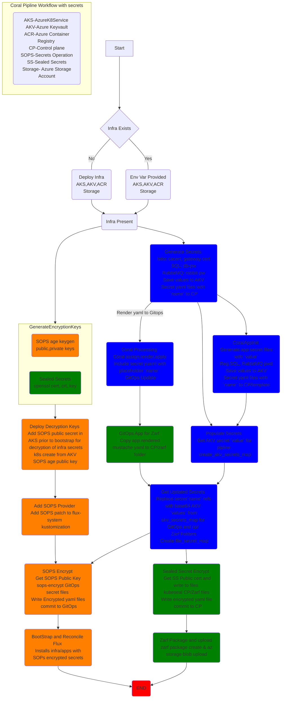

# Flow Chart For Workflow Pipeline for Secrets

**Author:** Swetha Anand, Dave Seepersad

**Date:**  2/27/2023

```mermaid
flowchart TD
    A[Start] --> B{Infra Exists}
    B ---|No|R(Deploy Infra <BR> AKS,AKV,ACR <BR> Storage)
    B ---|Yes|S(Env Var Provided <BR> AKS,AKV,ACR <BR> Storage)
    R --> Z(Infra Present)
    S --> Z
    Z -->E(Generate Secrets <BR> Istio: cacert, gateway cert <BR> SQL: db-pw <BR> RabbitMQ: rabbit-pw <BR> Save values to AKV <BR>Secret yaml files with `name` to CP):::blue
    
    subgraph GenerateEncryptionKeys
    a1(SOPS age keygen <BR> public,private keys):::orange
    a2(Sealed Secrets <BR> openssl cert,.crt,.key):::green
    end

    subgraph Coral Pipline Workflow with secrets
    b1(AKS-AzureK8Service <BR> AKV-Azure Keyvault <BR> ACR-Azure Container Registry <BR> CP-Control plane <BR> SOPS-Secrets Operation <BR> SS-Sealed Secrets <BR> Storage- Azure Storage Account)
    end

    Z --> GenerateEncryptionKeys
    GenerateEncryptionKeys --> G(Deploy Decryption Keys <BR> Add SOPS public secret in AKS prior to bootstrap for <BR>  decryption of infra secrets <BR> k8s create from AKV SOPS age public key):::orange
    E --> H(Populate Secrets <BR> Get AKV secret `value` for pipline <BR> create_akv_secrets_map ):::blue
    E --> F(CoralAppInit <BR> Generate app secret files with `value`<BR> Reg.SQL, RabbitMQ pwd <BR> Save values to AKV <BR>Secret yaml files with `name` to CP/template):::blue
    F --> H
    G --> I(Add SOPS Provider <BR> Add SOPS patch to flux-system <BR> kustomization):::orange
    E --> |Render yaml to Gitops|J(Coral Processing <BR> Coral assign,render,apply <BR> Include secret yuaml with placeholder `name` <BR> GitOps Update):::blue
    J --> K(GitOps App for Zarf <BR> Copy app rendered mustache yaml to CP/zarf folder):::green
    K --> L(Get Updated Secrets <BR> Replace secret`name` refs with base64 AKV <BR> `values` from akv_secrets_map for GitOps and cp/ <BR> Zarf Folders <BR> Create file_secret_map):::blue
    H --> L
    I --> N(SOPS Encrypt <BR> Get SOPS Public Key <BR> sops-encrypt GitOps secret files <BR> Write Encrypted yaml files <BR> commit to GitOps):::orange
    M --> O(Zarf Package and upload <BR> zarf package create & az storage blob upload):::green
    N --> P(BootStrap and Reconcile Flux <BR> Installs infra/apps with SOPs encrypted secrets):::orange
    P -->Q(END):::red
    L --> M(Sealed Secret Encrypt <BR>  Get SS Public cert and write to files <BR> kubeseal CP/Zarf files <BR> Write encrypted yaml file <BR>  commit to CP):::green
    L --> N
    O --> Q
   

    classDef orange fill:#FF8000
    classDef blue fill:#0000FF
    classDef green fill:#008000
    classDef red fill:#ff0000
```