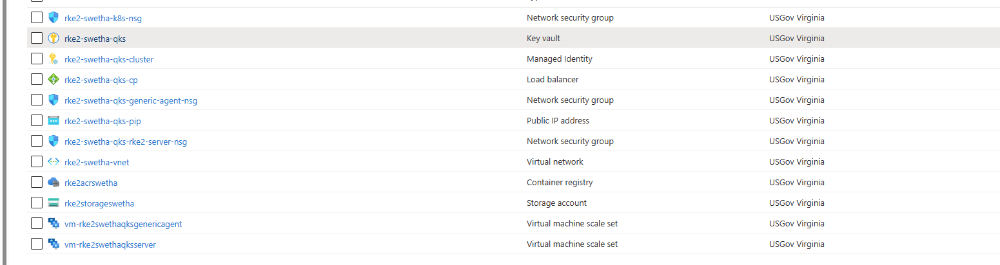

# RKE2 Kubernetes distribution With Flux on GitHub

**Author:** Swetha Anand
**Date:** 02/9/2023

## Overview

RKE2, also known as RKE Government, is Rancher's next-generation Kubernetes distribution. It focuses on security and compliance within the U.S Federal Government sector.

### Installation

Refer to the document [RKE2-cluster](../design-decisions/RKE2-cluster.md) for more details on installation of RKE2 cluster using the public Rancher federal terraform script.

- Deploy the RKE2 cluster into Azure, [latest stable version](https://github.com/rancher/rke2/releases) "v1.24.10+rke2r1" was used for this Spike Story.
- [Key Vault](https://learn.microsoft.com/en-us/azure/key-vault/general/quick-create-portal) created under same resource group.
- [Storage account](https://learn.microsoft.com/en-us/azure/storage/common/storage-account-create?toc=%2Fazure%2Fstorage%2Fblobs%2Ftoc.json&tabs=azure-portal) created under same resource group.
- [Container Registry](https://learn.microsoft.com/en-us/azure/container-registry/container-registry-get-started-portal?tabs=azure-cli) created under same resource group.



### Storage

From Azure portal, Get the kubeconfig file from the above created KeyVault -> secrets -> Kubeconfig.

Create the default [Rancher local path provisioner](https://github.com/rancher/local-path-provisioner) on the RKE2 cluster. Control plane currently has few infrastructure resource such as sql edge, elastic search and others which depend on the default storage to be existing on the RKE2 cluster.

Refer to the [document](https://docs.ondat.io/docs/install/rancher/rancher-gov/) for more info on how to install local path provisioner.[Set this storage to be the default storage class](https://kubernetes.io/docs/tasks/administer-cluster/change-default-storage-class/).

```bash
kubectl apply -f https://raw.githubusercontent.com/rancher/local-path-provisioner/v0.0.23/deploy/local-path-storage.yaml
kubectl get pod --namespace=local-path-storage
kubectl -n local-path-storage get pod
kubectl get storageclass

kubectl patch storageclass local-path  -p '{"metadata": {"annotations":{"storageclass.kubernetes.io/is-default-class":"true"}}}'
```

## References

- Local Path Provisioner: <https://github.com/rancher/local-path-provisioner>
- Azure File CSI Driver: <https://github.com/kubernetes-sigs/azurefile-csi-driver>
- Azure CSI driver,Reading config from K8 Secrets: <https://github.com/kubernetes-sigs/azurefile-csi-driver/blob/master/docs/read-from-secret.md>
- RKE2: <https://docs.rke2.io/>
- Rancher Storage Class Configuration Guide: <https://ranchermanager.docs.rancher.com/v2.5/how-to-guides/new-user-guides/kubernetes-clusters-in-rancher-setup/launch-kubernetes-with-rancher/use-windows-clusters/azure-storageclass-configuration>
- Rancher Setting up Azure Cloud Provider:<https://ranchermanager.docs.rancher.com/v2.5/how-to-guides/new-user-guides/kubernetes-clusters-in-rancher-setup/launch-kubernetes-with-rancher/set-up-cloud-providers/other-cloud-providers/azure>
