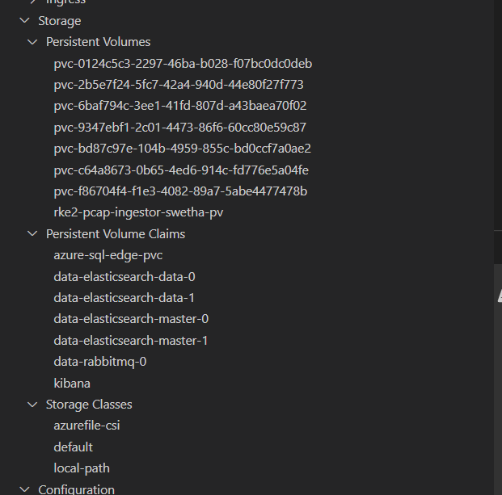
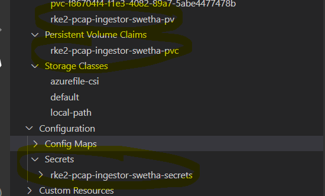

# RKE2 Kubernetes distribution With Flux on GitHub

**Author:** Swetha Anand
**Date:** 02/9/2023

## Overview

[Flux](https://fluxcd.io/flux/) is a tool for keeping Kubernetes clusters in sync with sources of configuration (like Git repositories), and automating updates to configuration when there is new code to deploy.

In this Spike we document the process of deploying the network-observability-control-plane to RKE2 Cluster with flux.

## Pre-requisites

Create the RKE instance by following the [cluster.md](cluster.md) document.

The Network Observability control plane seed deploys few infrastructure resources such as SQL, Elastic Search and others which depend on the default Storage. For this the, `Rancher local path provisioner` was created on RKE2 cluster as default storage in the cluster setup.

Network Observability App seeds such as pcap ingestor/processor, event processor, netstats generator uses `azurefile-csi` storage for file ingestion, which will be created below.

## Deployment

### Steps

Before getting started, please review [network observability control plane guide](../../README.md) in the main repo. This Document replaces the deployment of network observability control plane from AKS cluster to RKE2 Cluster.

  1. Login to azure account in terminal, set the right AZ environment.
  2. Create a service principal and assign owner role. Need Admin rights for creating SP.
  3. Grant the KV Access Policy Roles to the Service Principal Created from Azure portal, KV -> AccessPolicies -> Create -> key,secret,certificateManagment -> ServicePrincipalClientID
  4. Use the `coral init` to create the instance of the network observability control plane seed, git clone it in local and open it up in vscode.
  5. VS Code, use the RKE kubeconfig to connect to the kubernetes cluster using kubernetes extension, and also export it in terminal

        ``` bash
        az login
        az account show
        az account set --subscription <SubscriptionName>
        az ad sp create-for-rbac --name <name> --role owner --scopes /subscriptions/<subscription_id>/resourceGroups/<rg_name> --sdk-auth

        export GITHUB_TOKEN=<GitHubToken>
        coral init github --control-plane-seed microsoft/network-observability-control-plane-seed --control-plane consto/rke2-example-cp
        git clone <consto/rke2-example-cp>
        export KUBECONFIG=<kubeconfig-from-keyvault>
        ```

  6. On the Control plane instance(`consto/rke2-example-cp`) create these below repo variables

        ```bash
        DEPLOY_INFRA=false (This flag turns off the automated deployment to the AKS cluster)
        AZURE_CREDENTIALS=<service-principal-created-above-as-json>
        AZURE_CLOUD=<AzureCloudValue>
        KEYVAULT_NAME=<key-vault-created-above>
        REGION=<region>
        ```

  7. Register the Cluster: if the cluster is named as dev, its registration might look like:

        ```bash
        cat <<EOF > clusters/dev.yaml
        kind: Cluster
        metadata:
          name: dev
          labels:
            cloud: azure
            region: usgovvirginia
            aksClusterName: rke2-name(default)
            aksClusterResourceGroup: rke2-rg
        spec:
          environments:
            - dev
            - prod
        EOF

        ```

  8.  The pipeline scripts currently takes in AKS Cluster as default, in order to make the control plane work for RKE2 cluster change the get credentials in the scripts to get the kubeconfig from RKE2.

        ```bash
        # Get AKS cluster's k8s credentials
        az aks get-credentials \
        --resource-group $cluster_rg \
        --name $cluster_name \
        --overwrite-existing
        ```

        ```bash
        # Get RKE2 cluster's credentials
        kubefile="${KEYVAULT_NAME}config"
        az keyvault secret show --name kubeconfig --vault-name "$KEYVAULT_NAME" -o json | jq -r '.value' >"$kubefile"
        export KUBECONFIG=$kubefile
        ```

  9.  Change the manifest/azure-sql-edge/charts/values.yaml to use this default local path storage class. All the other infrastructure resources should work as is with the local path default storage class

        ```bash
        pvc:
            storageClass: local-path
            storageSize: 10Gi
        ```

  10. Commit all the above changes to github, which should start the workflow actions pipeline for the control plane, and it will successfully deploy all the infrastructure related resources to the RKE2 cluster and the corresponding pv's and pvc's gets created bounded to the local-path storage.

      

  11. Now for the Application Integration which requires the `azurefile-csi` storage, we need to manually create this in the RKE2 cluster.

        ```bash
        cat <<EOF > azurefilecsi-storageclass.yaml
        kind: StorageClass
        apiVersion: storage.k8s.io/v1
        metadata:
          name: azurefile-csi
        provisioner: file.csi.azure.com
        reclaimPolicy: Delete
        volumeBindingMode: Immediate
        allowVolumeExpansion: true
        mountOptions:
          - dir_mode=0640
          - file_mode=0640
          - uid=0
          - gid=0
          - mfsymlinks
          - cache=strict # https://linux.die.net/man/8/mount.cifs
          - nosharesock
        parameters:
          skuName: Standard_LRS
        EOF

        ```

        ```bash
        kubectl apply -f azurefilecsi-storageclass.yaml
        ```

  12. Run the coral app init using the coralAppInit.sh script defined in the [README](../../README.md) (#Application / Network Observability solution deployment) for the app deployments, and the corresponding pv's and pvc's for azurefile-csi gets created.

      

